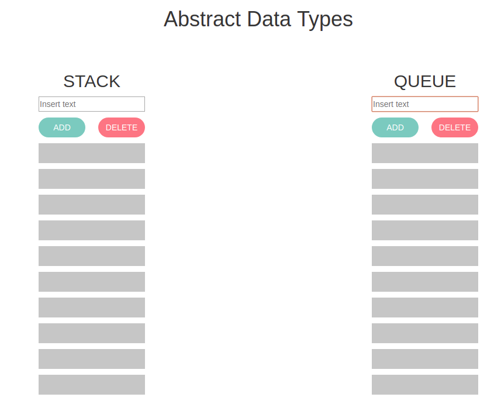

## DATA STRUCTURE

<p align="center">
  
</p>

Stacks and queues are two types of linear data structure we can easily find in real-life. In this project, I show both models in a graphical and dynamical representation.

### **Features**

Stack
- Every time an element is added, it goes on the top of the stack.
- The only element that can be removed is the element that was at the top of the stack.
- It's also called LIFO queue ("last in, first out").
- We can match the concept to a stack of books.

Queue
- The elements are added in arrival order.
- To delete an element, it has to be the first arrival element of the queue.
- It's also called FIFO queue ("first in, first out").
- It's the same idea of supermarket's queues.

### **Setup**
---
If you’d like to view my project in your browser:

- Clone the repository in your computer, you can type the following command in your terminal
```bash
git clone https://github.com/diana-moreno/data-structure.git
```
- Open data-structure's folder.
- Open index.html
- Otherside, you can run the project here: https://diana-moreno.github.io/data-structure/


### **What I learned**

- Organize code with Constructor Pattern.
- Develop stack and queues data structure logic.
- Create a visual layout to show how stacks and queues work.
- Split code in different files.
